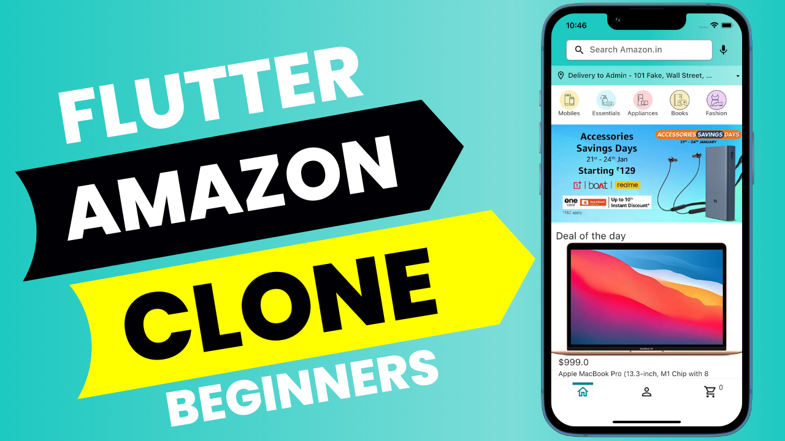

# Amazon Clone

Flutter - Full Stack Amazon Clone along with Admin Panel.

check out tutorial on YouTube channel [Rivaan Ranawat](https://youtu.be/O3nmP-lZAdg) 



## Features

- Email & Password Authentication
- Persisting Auth State
- Searching Products
- Filtering Products (Based on Category)
- Product Details
- Rating
- Getting Deal of the Day
- Cart
- Checking out with Google/Apple Pay
- Viewing My Orders
- Viewing Order Details & Status
- Sign Out
- Admin Panel
  - Viewing All Products
  - Adding Products
  - Deleting Products
  - Viewing Orders
  - Changing Order Status
  - Viewing Total Earnings
  - Viewing Category Based Earnings (on Graph)

## Running Locally

After cloning this repository, migrate to `flutter-amazon-clone` folder. Then, follow the following steps:

- Create MongoDB Project & Cluster
- Click on Connect, follow the process where you will get the uri.
- Replace the MongoDB uri with yours in `server/.env` (copy from `server/.env.example`).
- Create Cloudinary Project, enable unsigned operation in settings.
- Copy `.env.example` to `.env`, replace `CLOUDINARY_CLOUD_NAME` and `CLOUDINARY_UPLOAD_PRESET` with your Cloud Name and Upload Preset respectively.
- Head to `.env` file, replace `API_BASE_URL` with your IP Address.

Then run the following commands to run your app:

### Server Side (API Serever)

run in `flutter-amazon-clone/server` folder

```shell
cd server

npm install

npm run dev
 # or
npm start
```

### Client Side

run in `flutter-amazon-clone` folder

```shell
flutter pub get

flutter run
```

## Used

**Server**: Node.js, Express, Mongoose, MongoDB, Cloudinary

**Client**: Flutter, Provider
